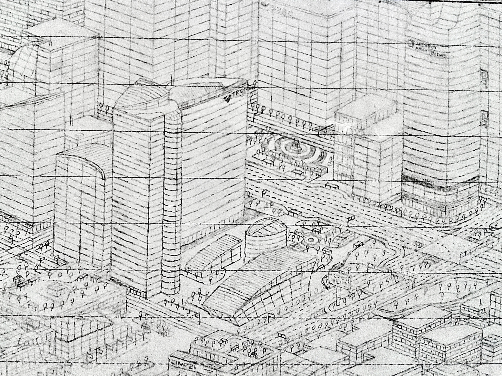
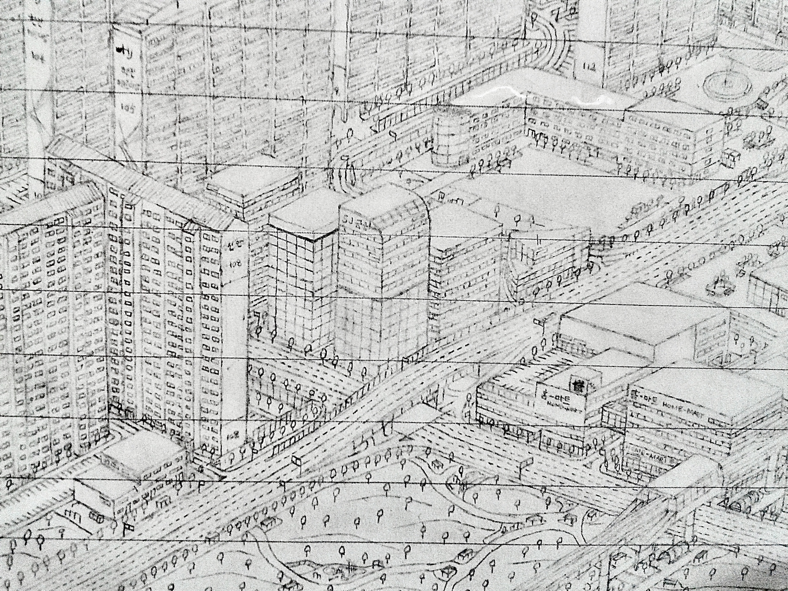
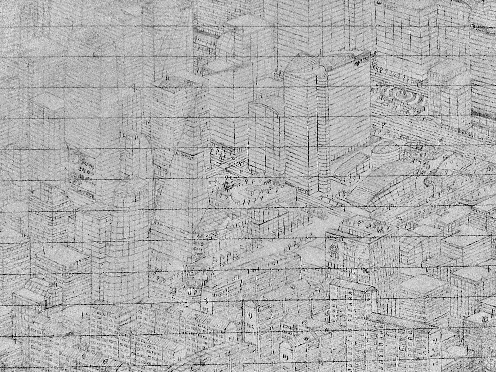

어렸을 때는 전자공학이나 컴퓨터공학보다는 건축학이나 도시공학을 하고 싶었다.
이 작품은 꿈이 바뀌기 전에 남긴 흔적이다.

공책에 낙서하는 건 예나 지금이나 많이 하는 일인데,
문득 상상으로 건물들을 구성하여 하늘에서 바라본 도시의 장면을 그려보고 싶었다.

그렇게 한 페이지를 다 채워서 그린 게 중학교 2학년 때 3장, 3학년 때 1장이었고 이건 마지막의 것이다.
수업시간에 수업은 안 듣고 조금씩 그리다 질리다 다시 그리다 했던 작업이 한 3달 걸렸나 싶다.

지금은 원본이 남아있지 않고, 이 사진들은 주요 부분만 찍어 두었던 것을 명암처리한 것이다.

