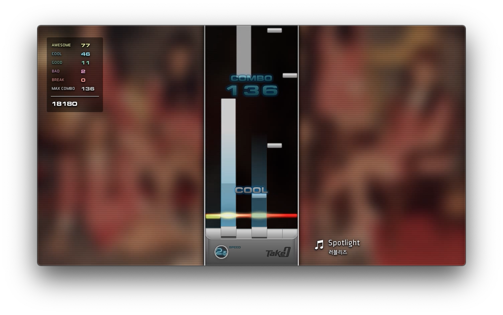

<ul class="grid-34 ul-no-disc" style="margin-bottom: 4em;">
    <li class="grid grid-34">
        <h6 class="grid-3">소스 코드</h6>
        
<a href="https://github.com/canplane/Take-0">GitHub</a>

    </li>
    <li class="grid grid-34">
        <h6 class="grid-3">작업 기간</h6>
        
2015. 6. 5. ~ 11., 2022. 7. 8. ~ 30.

    </li>
    <li class="grid grid-34">
        <h6 class="grid-3">사용 기술</h6>
        
Adobe Flash CS6 (ActionScript 3.0)

    </li>
</ul>

    

        <iframe src="https://www.youtube.com/embed/DAvBte0al1M" frameborder="0" allowfullscreen></iframe>
    

리듬 게임을 구현하고 싶다는 생각이 들어, DJMAX를 오마주 삼아 7년 전 제작했던 물건.

오랜만에 다른 사람이 즐길 수 있을 정도로 완성도를 높이고 싶다는 생각이 들었다.

외관이 크게 바뀌지는 않았으나, BPM, HP, 피버 시스템, 4~8키 모드 지원, 사용자 설정 등 많은 기능을 추가했고, 최적화를 위해 코드를 통째로 뒤집었다.

이 영상은 이후 여러 곡들로 테스트를 진행하는 과정에서 찍은 것이다.

