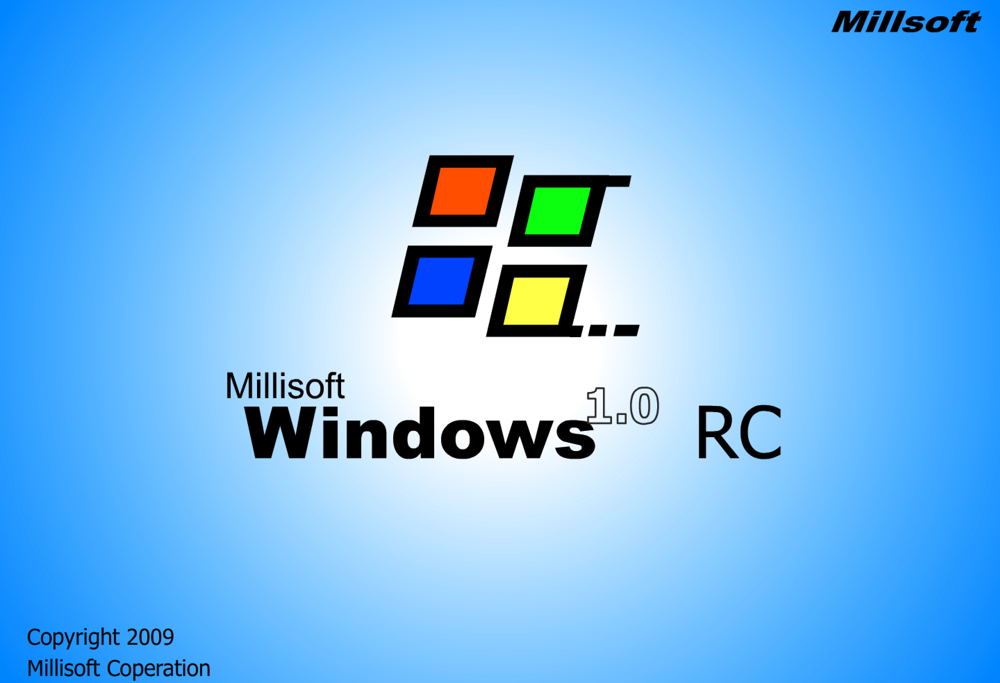
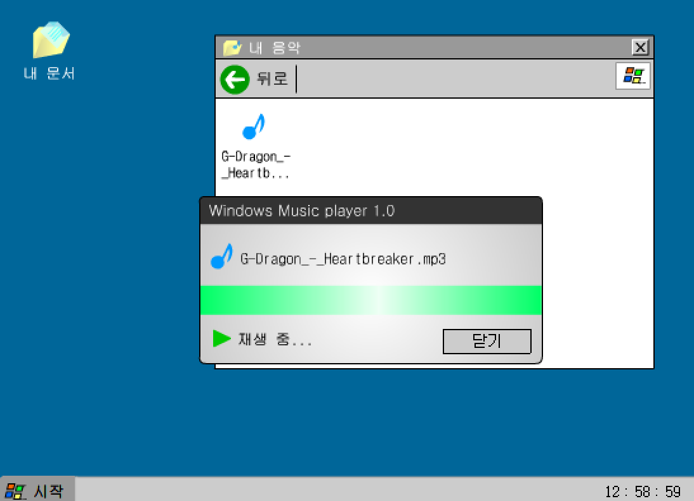
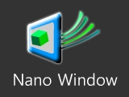
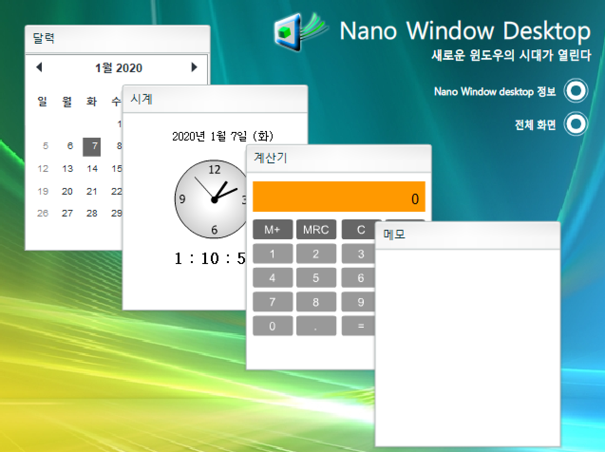

import Section from "@/components/mdx/Section.astro";
import Col from "@/components/mdx/Col.astro";

<Section>
<Col span="12">

</Col>
<Col span="34">

프로그래밍에 처음 발을 들여놓게 된 시작점이라 말할 수 있는 작품이다.

중학교 2학년 때 한창 공책에 만화를 그리는 취미가 있었는데, 친구가 이지툰이라는 GIF 애니메이션 툴을 소개해 주었다.
그러나 이지툰은 자연스러운 애니메이션을 그리기 위해 프레임마다 일일이 그려야 하는 노가다 과정이 필요했다.
얼마 지나지 않아 애니메이션을 훨씬 쉽게 만들 수 있는 제작 도구인 플래시로 관심이 옮겨 갔다.

그런데 이 플래시라는 것이 단순히 애니메이터라기보단 프로그래밍 도구로도 쓸 수 있는 혼종이었던 것이다.
자연스럽게 프로그래밍을 약간 접하게 되었고 그러다 보니, 한번 보면 끝나는 애니메이션보단 사용자들이 지속적으로 활용할 수 있는 프로그램을 만들고 싶어졌다.

한창 Windows 7 발표와 더불어, [티맥스 윈도우](https://designlog.org/2511888)라는 국산 OS 시연회로 많은 이슈가 있던 시기였다.
나도 운영체제의 GUI를 만들어 보고 싶었고, 그렇게 하여 첫 프로그램이 탄생했다.

사실 프로그래밍을 했다고 말하기에는 좀 민망한데, 프레임마다 캡처 화면같은 것들을 그리고 버튼을 눌러 다음 또는 이전 장면으로 넘어가는 식으로 만들었기 때문이다.
창을 드래그하는 효과도 없고, 많은 메뉴를 막아놓고 현재 버전에서는 이용할 수 없다고 표시하는 식으로 꼼수를 썼다.
민망해서 그런지 데모라는 느낌을 주기 위해 RC라는 버전 네이밍을 붙였는데, Windows 7 시험 버전에서 따온 것이다.(사실 RC는 릴리즈 후보라는 뜻이지만)

</Col>
</Section>

<Section>
<Col span="12">

</Col>
<Col span="34">

일단 이렇게 첫 버전을 만들어 보니 다음 버전은 더 제대로 만들고 싶었다. 그래서 일단 간지나는 로고를 만들었다.
스크린 뒤의 광원이 투영되어 물체를 그려낸다는 의미를 담고 싶었다.

</Col>
</Section>

<Section>
<Col span="12">

</Col>
<Col span="34">

1.0으로는 윈도우 고전 테마를 모방했으니 2로 넘어가면 비스타와 7의 에어로 테마를 모방해보려 했다.
그런데 얼마 안 가서 실제 OS가 될 수도 없는데 모방해봤자 의미없단 생각이 들었다.

진짜로 활용할 만한 작품을 만들어보자 싶어서 여러 생활 기능이 들어간 프로그램을 만들었다.
시계, 달력, 메모, 계산기 기능이 들어 있다.
이러한 종합 선물세트 컨셉은 이후에 만든 NAVE라는 프로그램으로 이어진다.

</Col>
</Section>

<Section>
<Col span="4">

### [NAVE →](/2010-10-24-nave/)

</Col>
</Section>
