import Section from "@/components/mdx/Section.astro";
import Col from "@/components/mdx/Col.astro";
import Field from "@/components/mdx/Field.astro";
import FieldList from "@/components/mdx/FieldList.astro";

<Section>
<FieldList>
<Field label="Repository">[github.com/canplane/PIVOT](https://github.com/canplane/PIVOT)</Field>
</FieldList>
<Col span="34">

집에서 쓰던 컴퓨터가 느려서 전원을 누르고 사용하는 데까지 오랜 시간이 걸렸다.
인터넷 속도도 느린 건 똑같아서, 검색을 위해 먼저 브라우저를 실행하고 포털 사이트에 접속하는 일은 상당한 고역이었다.
검색어를 입력하면 검색 결과 페이지로 바로 이동시켜 주는 프로그램을 만들어야겠다 싶었다.

사실 툴바 프로그램 하나라도 깔려 있는 게 일반적이던 시절이었다.
이미 알툴바의 [스마트홈](https://altools.tistory.com/156)이나, [네이버 데스크바](https://www.newswire.co.kr/newsRead.php?no=244496)와 같은 서비스들이 존재했다.
그렇지만 내가 이용할 프로그램이니 이 참에 직접 만들어 보고 싶었다.
이름은 NAVE로 지었는데, 네이버를 연상시키는 명칭은 NAVigation Explorer에서 따온 것이다.

</Col>
</Section>

## 1.0

<Section>
<FieldList>
<Field label="Release">2010-10-24</Field>
</FieldList>

<Col span="12">

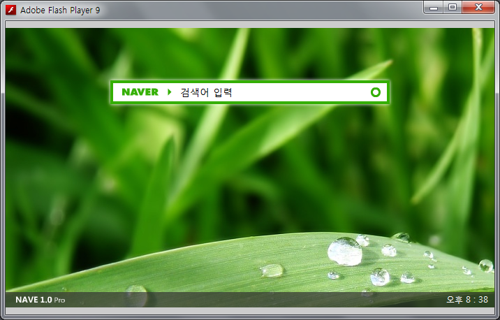

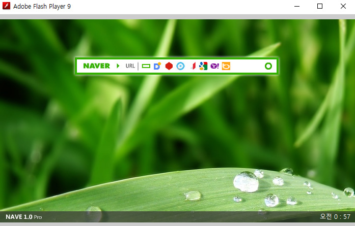

</Col>
<Col span="34">

만들고 싶었던 동기에 맞는 아주 간단한 프로그램을 완성했다.

URL 주소와 8개 검색 엔진(네이버, 다음, 네이트, 구글, 야후, 파란, 열린주소창, Bing)과 연결되는 검색 창이 있는 프로그램이다.
입력하면 바로 브라우저가 켜지고 검색 결과로 이동할 수 있고, 포털 사이트 로고 오른쪽에 있는 화살표 버튼을 눌러 검색 엔진을 선택할 수 있다.

검색 창만 두기엔 허전하니까 우측 하단에 시간을 표시하는 기능도 두었다.

</Col>
</Section>

## 1.2

<Section>
<FieldList>
<Field label="Release">2010-11-11</Field>
</FieldList>

<Col span="12">

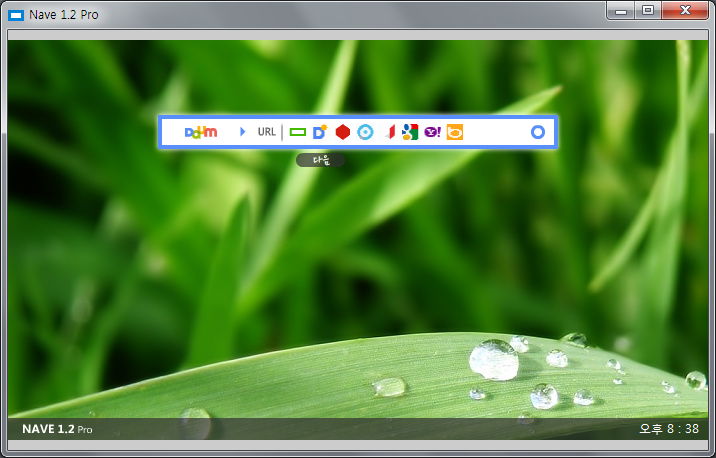

</Col>
<Col span="34">

첫 버전을 만들고 보니 약간 아쉬운 점이 있었다.

검색 엔진을 바꾸기 위해 마우스를 두 번이나 클릭해야 한다는 것이었는데, 그래서 위, 아래 화살표 키를 이용해서 검색 엔진을 전환할 수 있도록 했다.
그리고 선택 메뉴가 포털 사이트 아이콘으로만 이루어져 있었는데, 마우스를 갖다 대면 이름이 표시되도록 기능을 추가하였다.
추가로 검색 창 폰트를 '나눔손글씨 펜'으로 바꾸어 산뜻한 느낌을 주었다.

</Col>
</Section>

## 1.3

<Section>
<FieldList>
<Field label="Release">2010-11-22</Field>
</FieldList>

<Col span="12">

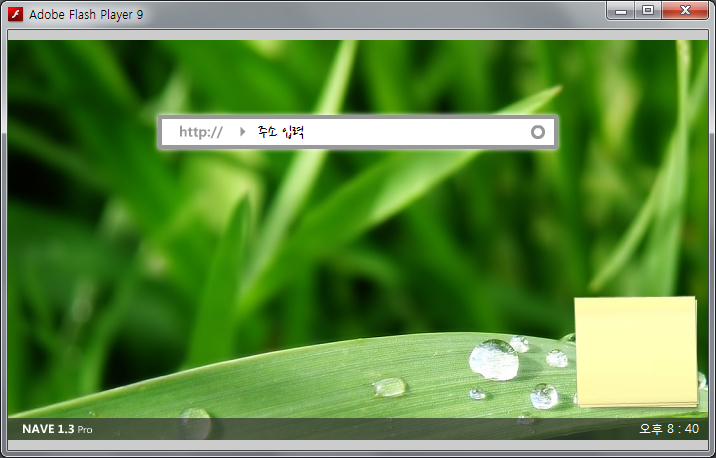

</Col>
<Col span="34">

슬슬 간단한 프로그램을 확장해서 활용도를 높여보고 싶었고, 일단은 먼저 메모 기능을 추가해보았다.

그러고 나니 이벤트 충돌이 이슈가 되었다.
메모를 할 때는 줄바꿈도 필요하고 그럴 때마다 Enter 키도 눌러야 하는데, 문제는 그럴 때마다 검색 창도 검색을 하게 된다는 것이다.
이전 버전에서 추가한 상하 키 이동 기능도 문제였다.

그래서 제일 단순한 방법으로 문제점을 해결했다.
키보드로 검색 창을 조작하는 기능을 없애버린 것이다.
당연하게도 이 버전은 사용하기에도 제일 불편할 수밖에 없었다.

</Col>
</Section>

## 1.5

<Section>
<FieldList>
<Field label="Release">2010-12-05</Field>
</FieldList>

<Col span="12">

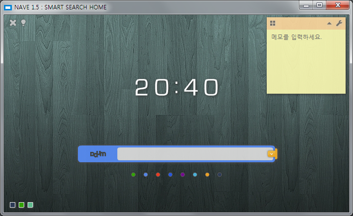

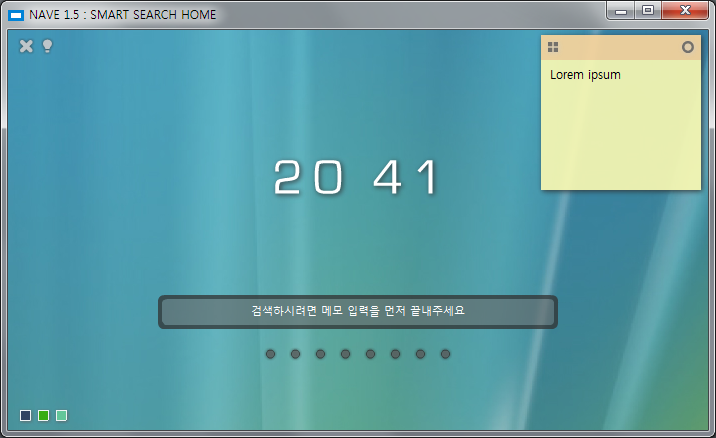

</Col>
<Col span="34">

아무래도 검색할 때마다 마우스로 버튼을 일일이 클릭한다는 건 말도 안 되는 방법이었다. 사용자 경험이 구렸기 때문이다.

그래서 다른 방법을 고안했다. 메모 입력 시작, 완료 버튼을 두어 입력 시에 검색 창이 비활성화되도록 만들었다.
그렇게 해서 이벤트 충돌을 막을 수 있었고, 다시 키보드로만 검색을 할 수 있게 되었다.
물론 이것도 썩 좋은 방법은 아니지만 내가 생각할 수 있는 최선이었다.

그리고 테마를 갈아엎었다.
검색 창 하단에 각 검색 엔진마다 대표 색깔로 된 원형 버튼을 배치해서 동선을 줄이고, 마우스를 올리면 창에 포털 사이트 로고가 나타나도록 했다.
또한 이전 버전들에서는 '검색어 입력'이란 텍스트를 지우고 검색어를 입력해야 하는 불편함이 있었는데 이 역시 개선하였다.
추가로 중앙에 벽걸이 시계마냥 시간이 간지나게 표시되도록 했고, 프로그램 배경도 선택할 수 있도록 했다.(사실 종료하고 다시 실행하면 리셋되어서 의미가 없는 기능이었다.)

당시 다음이 유독 포털 사이트 검색 버튼이 예뻤는데, 프로그램에서도 다음만 검색 버튼 디자인을 그대로 가져온 것도 소소한 특징이다.

</Col>
</Section>

## 1.6

<Section>
<FieldList>
<Field label="Release">2011-03-01</Field>
</FieldList>

<Col span="12">

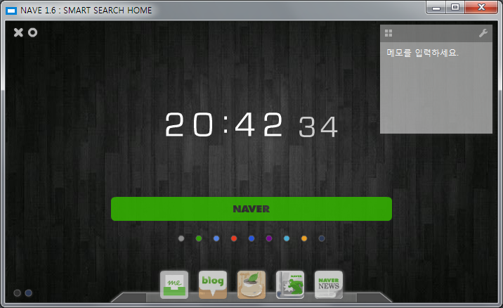

</Col>
<Col span="34">

검색 절차를 줄이기 위한 본연의 목적에는 이미 충분히 충실했다. 그래서 이번엔 포털 사이트에서 제공하는 다양한 서비스로도 이동하는 기능을 추가했다.

아이폰의 독바를 모방해서, 검색 엔진을 네이버나 다음으로 설정하면 블로그, 카페, 웹툰, 뉴스, 지도 등의 바로가기 모음이 하단에 표시되도록 하였다.

</Col>
</Section>

## NClock

<Section>
<FieldList>
<Field label="Timeline">2011-07-19</Field>
</FieldList>

<Col span="12">

</Col>
<Col span="34">

프로젝트를 진행하던 와중에, 알람 기능을 구현해보고 싶어 별도로 만들어 본 프로그램.

시간 설정만 제공하고 알람음 설정은 만들지 못하여 프로그램명에 BETA를 붙였다.
그래놓고 이후에 더 만들진 않은 것은 유머.

</Col>
</Section>

## 1.7

<Section>
<FieldList>
<Field label="Release">2011-11-05</Field>
</FieldList>

<Col span="12">

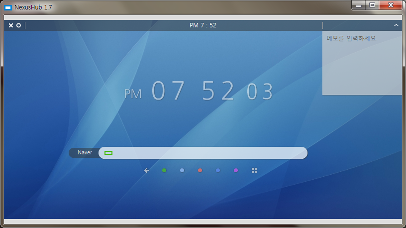

</Col>
<Col span="34">

좀 더 확연히 다른 차원으로 몸집을 키워보고 싶었다.

실시간 검색어 순위나 북마크, 알람, 사용자 설정 기능 등을 추가하여 편의성을 높이려 했으나, 프로그래밍을 제대로 배운 적이 없으니 많은 난관에 부딪히게 된다.
당시에는 그러한 복잡성을 감당하지 못했고, 결국 기본에 집중하는 것으로 방향을 틀어서 정리한 버전이 이것이다.

주요한 변경 사항은 다음과 같다.

- 포털 사이트를 연상시키는 프로그램명을 NexusHub로 변경
- 보안을 고려해서 검색 시 입력한 텍스트도 바로 지워지도록 개선
- 한 번에 여러 포털 사이트에서 검색할 수 있도록 동시 검색 버튼 추가
- 종료 후 다시 실행해도 적었던 메모를 유지하도록 저장 기능 추가
- 파란, 열린검색창, Bing 검색 엔진 제거

이전 버전에서 추가된 포털 서비스 바로가기는 제거되었는데, 북마크 메뉴로 확장하려다가 롤백했기 때문이다.

그리고 이전에 미봉책으로 덮었던 키보드 이벤트 충돌 문제는 깔끔하게 해결하였다.

검색을 하려면 한 번은 검색 창을 눌러야 하고, 메모를 하려면 한 번은 메모 창을 눌러야 한다. 즉 해당 요소를 이용하려면 먼저 [포커스](https://developer.mozilla.org/ko/docs/Web/CSS/:focus)가 이루어져야 한다는 것이다.
그런데 당시에는 이러한 문제를 어떠한 키워드로 검색해야 해결 방법을 찾을 수 있을지조차 모르는 수준이었다.

그래서 프로그램에 임의로 상태를 저장할 변수를 하나 두고, 이벤트 충돌과 관련된 요소들 중 하나를 클릭하면 그 요소의 이름이 저장되도록 했다.
활성화된 요소는 그 변수에 자기의 이름이 여전히 지정되어 있는지 실시간으로 확인하다가, 다른 요소가 포커스되어 다른 값으로 바뀌게 되면 다른 프레임으로 이동해서 키보드 이벤트를 받지 않도록 했다.

이것이 내가 고안한 해결 방법이었다. 비록 하드코딩으로 해결했지만, 반복문도 모르던 시기치고는 탁월한 아이디어가 아니었을까 싶다.

</Col>
</Section>

<Section>
<Col span="12">

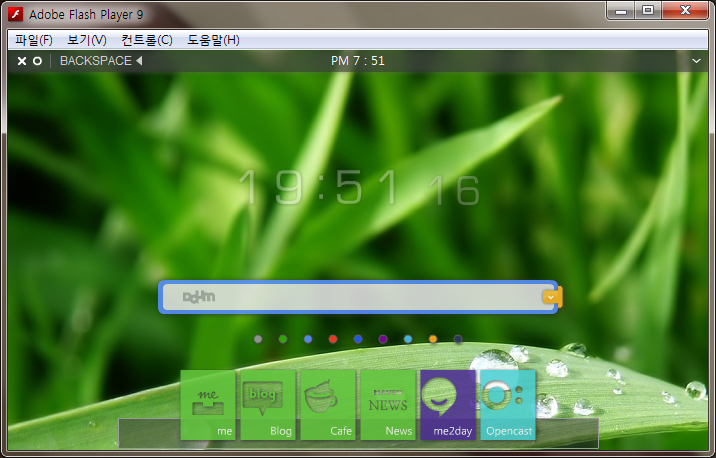

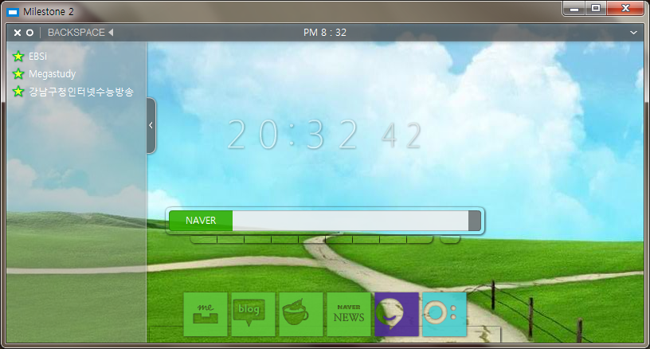

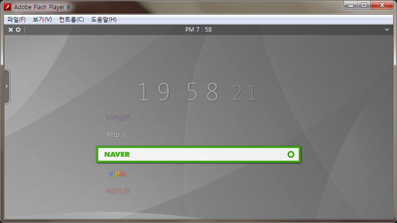

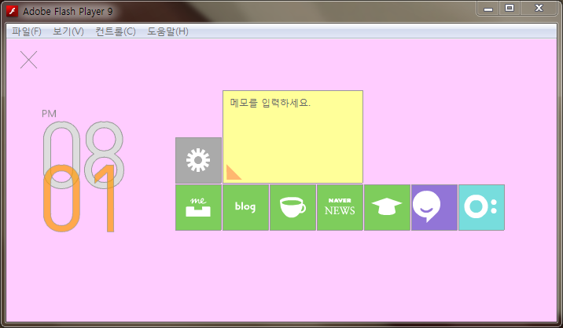

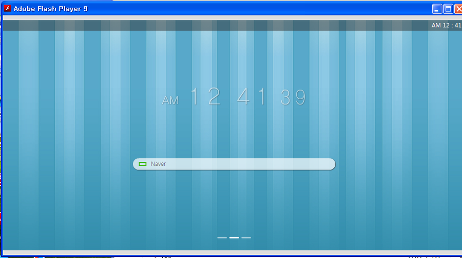

</Col>
<Col span="34">

이 사이 기간 동안 UI를 개선하기 위해 고민을 많이 했는데, 위 그림들은 개발 과정에서 나온 것들이다. 그래서 1.7 버전은 이전 버전들에 비해 외관에서는 확연히 정갈해진 부분이 있다.

또한 이 버전은 검색 기능에 충실한 가장 마지막 버전이라고도 할 수 있다. 이후부터는 여러 생활 기능을 앱 단위로 나누고 스마트폰의 런처에서 위젯을 띄우는 방식과 같은 형태로 발전하게 된다.

</Col>
</Section>

<Section>
<Col span="4">

### [PIVOT →](/2014-05-11-pivot/)

</Col>
</Section>
