import Section from "@/components/mdx/Section.astro";
import Col from "@/components/mdx/Col.astro";
import Field from "@/components/mdx/Field.astro";
import FieldList from "@/components/mdx/FieldList.astro";

<Section>
<FieldList>
<Field label="Repository">[github.com/canplane/PIVOT](https://github.com/canplane/PIVOT)</Field>
</FieldList>
<Col span="34">

[NAVE](/2010-10-24-nave/)는 저사양 컴퓨터나 느린 네트워크 환경에서 검색 시간을 줄여주고, 메모 기능까지 있는 적당한 프로그램이었다.

2011년 11월에 1.7 버전까지 만드는 과정에서 많은 부가 기능을 포함하려다가 중단하는 과정이 있었는데, 9개월 정도의 시간이 지나고 나서 다시 시작해보자는 생각이 들었다.

이제는 검색 절차를 개선하기 위한 프로그램에서, 다양한 용도로 활용할 수 있는 프로그램으로 방향이 바뀌었다.
기존의 검색, 메모 기능은 위젯 형태를 띤 각각의 앱이 되고, 프로그램은 여러 앱을 화면에 추가할 수 있는 홈 런처 플랫폼이 되었다.

</Col>
</Section>

<Section>
<Col span="12">

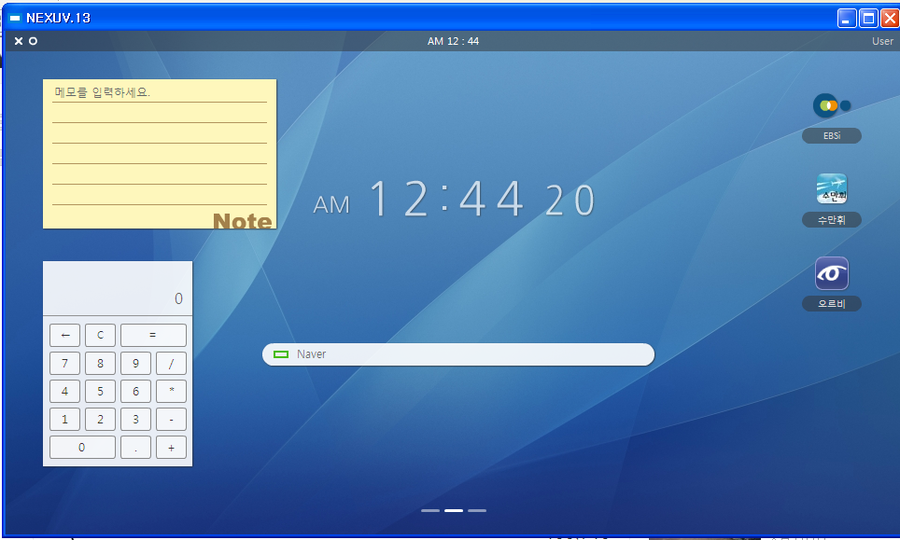

</Col>
<Col span="34">

먼저 홈 화면을 드래그로 이동할 수 있는 3개의 페이지로 나누고, 시계, 검색, 노트, 계산기, 북마크 위젯을 배치해 보았다.
그리고 좌상단의 원형 버튼을 눌러 편집 메뉴를 이동하거나 `e` 키를 눌러 위젯을 격자에 맞게 옮길 수 있도록 했다.

그런데 모듈화한 위젯들의 내용, 화면상에서의 위치 등의 상태 정보를 저장하고, 추가/제거 또는 내용 업데이트 등 만들어야 할 메뉴가 많다는 게 문제였다.
대입 준비로 바빴던 시절이었기 때문에 미완성인 상태로 다시 1년 반이 지나갔다.

</Col>
</Section>

<Section>
<Col span="12">

</Col>
<Col span="34">

수능이 끝난 직후 다시 프로젝트에 도전하게 되었다.
먼저 프로그램명을 중심점이 된다는 의미로 'PIVOT.14'로 바꾸었다. 뒤의 '14'는 2014년까지 완성할 것으로 생각해서 붙인 버전 네이밍이다.
또한 컴퓨터공학과 진학을 위해 C 언어를 익히다 보니, 본격적으로 프로그래밍을 공부하게 되었고 더 복잡한 코드를 설계할 수 있었다.

</Col>
</Section>

<Section>
<Col span="12">

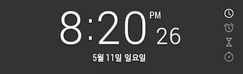

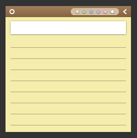

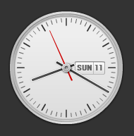

</Col>
<Col span="34">

디지털 시계, 노트, D-Day, 북마크, 아날로그 시계 등 여러 위젯들을 재구성했다.
디지털 시계는 알람, 타이머, 스톱워치 기능을 포함해서 더욱 복합적이게 되었다.
노트는 이제 여러 개를 저장할 수 있었고, 제목 및 색상을 지정할 수 있도록 했다.
D-Day는 1901년부터 2100년까지 기간을 설정할 수 있다.
추가로 검색 창에서는 야후를 ZUM으로 대체했다.

</Col>
</Section>

<Section>
<Col span="12">

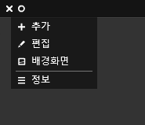

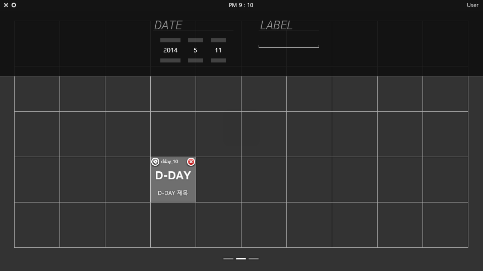

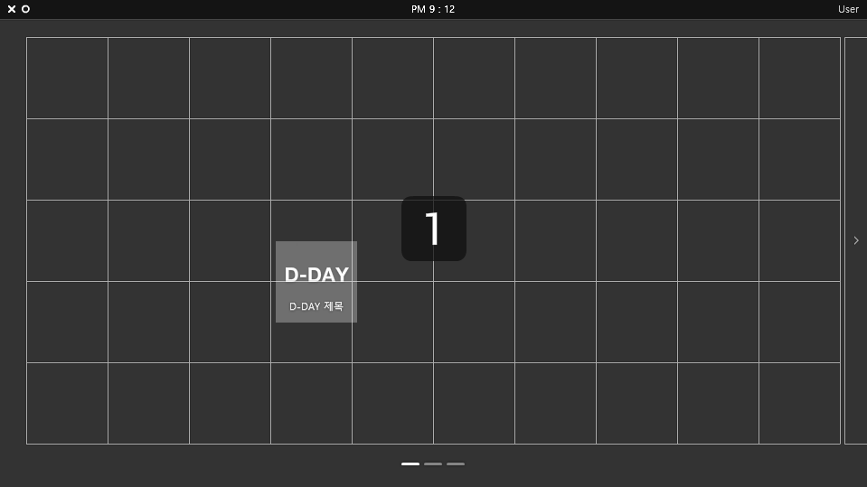

</Col>
<Col span="34">

위젯은 좌상단의 원형 버튼을 통해 추가 메뉴로 이동해서 화면에 새로 배치할 수 있고, 편집 메뉴로 이동해서 위치 이동, 삭제 또는 내용 업데이트를 할 수 있다. 또한 추가, 내용 업데이트, 배경화면 변경 등 설정이 필요할 때는 상단바가 아래로 내려오게끔 해서 영역을 구성했다.
하나 하나 구현해나가는 과정에서 안드로이드의 디자인을 다소 모방했는데, 이러한 점은 아쉬운 부분이다.

</Col>
</Section>

<Section>
<Col span="12">

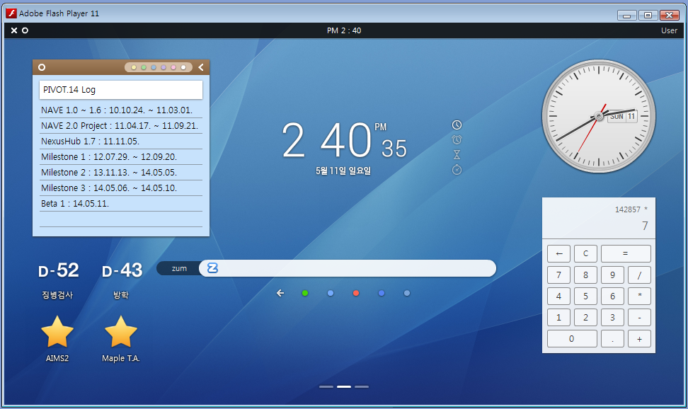

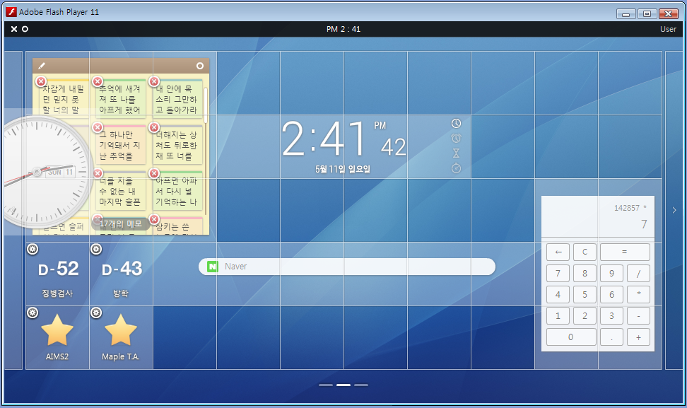

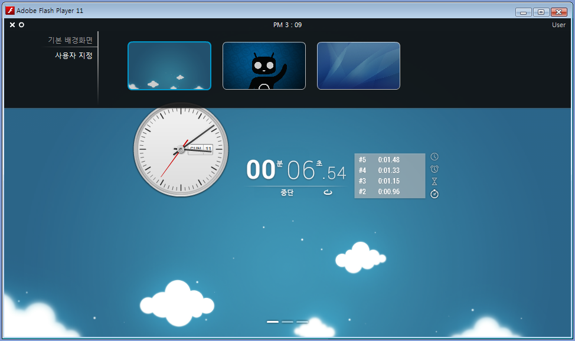

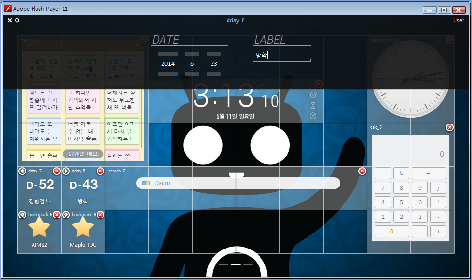

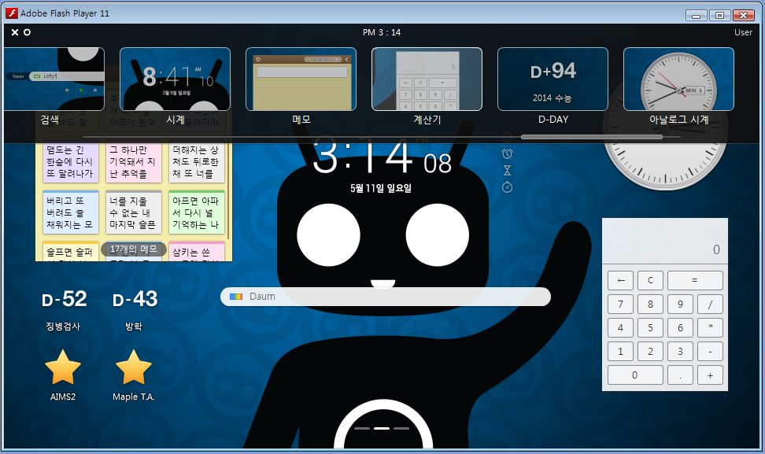

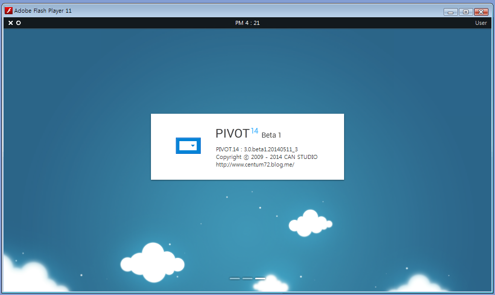

</Col>
<Col span="34">

많은 발전이 있었고, 이 정도면 내놓을 만 하겠다 싶어 2014년 중순에 Beta 1 버전을 내놓았다.

아직 내장 앱뿐만 아니라 외부에서 앱을 불러올 수 있거나, 계정 및 암호를 설정하는 시스템을 구현하지 못한 상태였다.
그러나 더 이상의 업데이트 역시 이 버전 이후로 없었다.

기능이야 더 구현할 수 있었겠지만 프로그램이 플래시에 기반한다는 것이 문제였다.
당시 플래시는 저물어가던 기술이었고, 그 안에서도 ActionScript 2.0이라는 이미 구식이 된 언어를 이용해서 프로그램을 작성했었다.

또한 내 스스로 생태계를 만들어 본다는 것은 좋은 아이디어였지만,
컴퓨팅 환경도 점점 스펙이 좋아지고, 네트워크 속도도 빨라지는 시대에 내가 만든 프로그램을 사람들이 사용해야 할 필요도 없었다.
바탕 화면이나 홈 화면에서 바로 위젯을 사용하는 방식도 아니었고, 굳이 프로그램을 실행해서 그 안에서 생활 기능을 아기자기하게 이용하는 것도 영 모양새가 이상했기 때문이다.
만약 2000년대와 같이 플래시 UI를 디바이스에 포함하던 시기였다면, 좀 더 활용할 면이 많았을지도 모르겠다.

</Col>
</Section>

<Section>
<Col span="34">

그렇게 4년에 걸친 습작을 마무리하게 되었다.
그러한 과정에서 UI/UX, 모듈화, 이벤트 처리 등 많은 일을 겪었었는데, 더 나은 개발을 위한 중요한 거름이 되지 않았나 생각이 든다.

</Col>
</Section>
